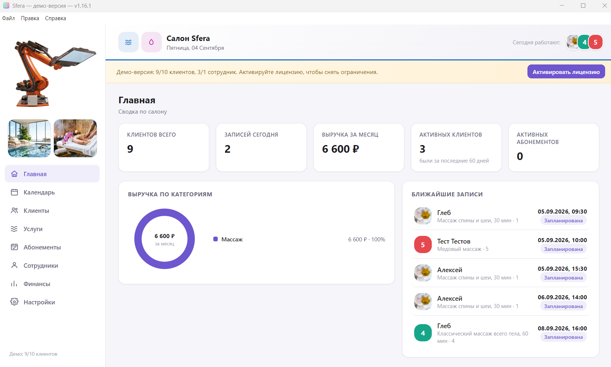
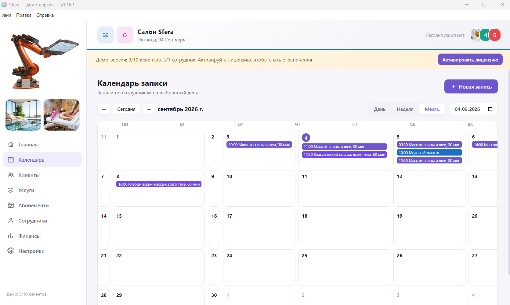
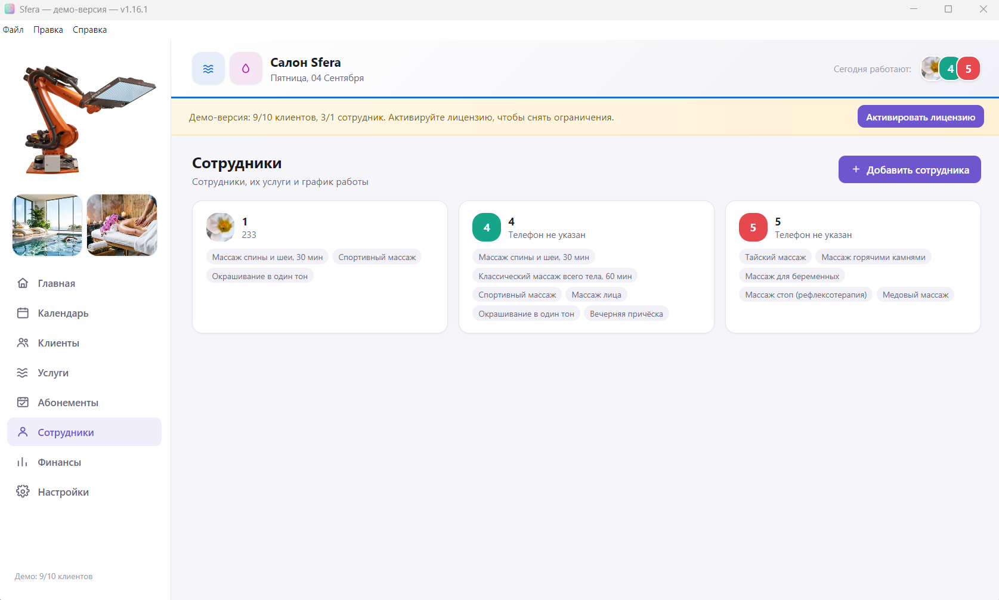
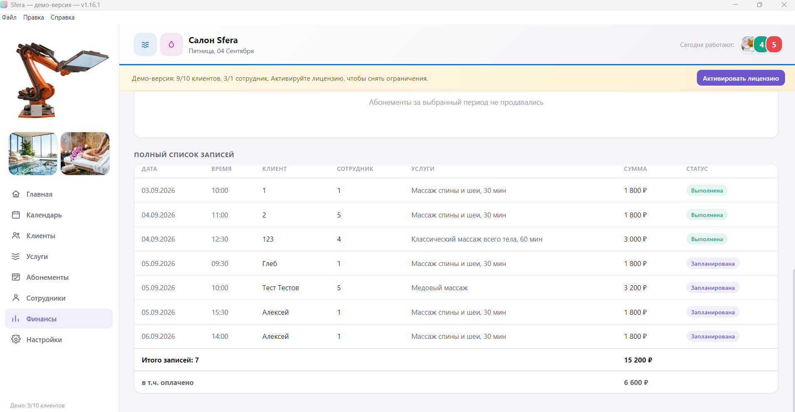
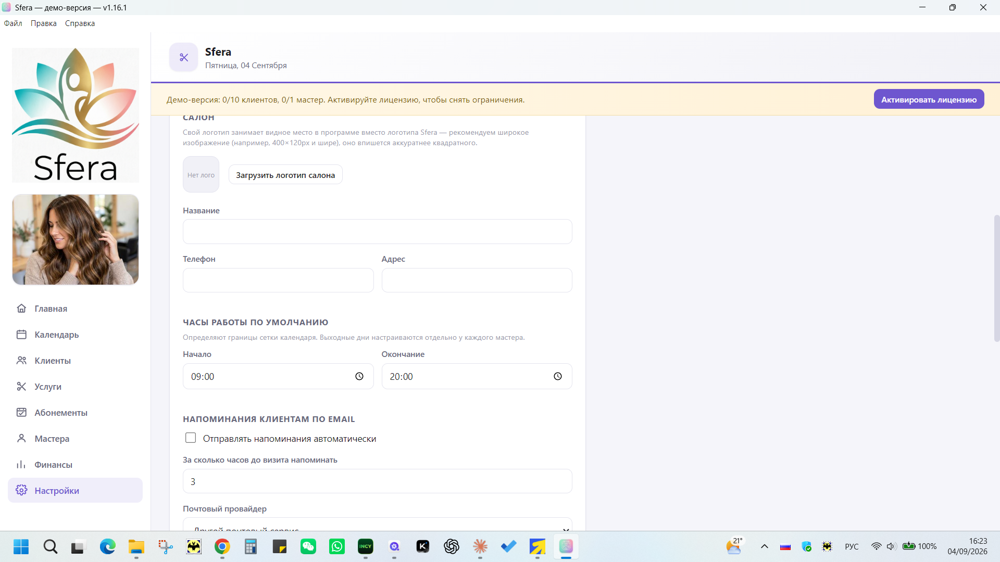
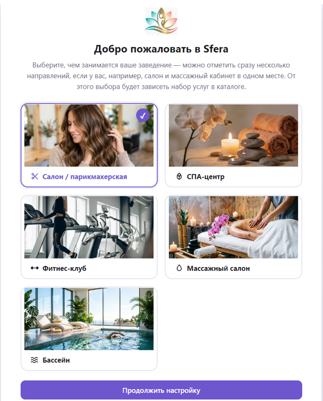

#Sfera

A client management and online booking program for beauty salons, spas, fitness clubs, massage parlors, swimming pools, and dental clinics. Supports multiple business types in a single program.

## Features

- **Main Page** — salon key metrics and revenue chart by category
- **24/7 online booking** via a separate web page — with stylist selection, automatic booking upload to the calendar, and instant notifications to the stylist
- **Subscriptions** — visit-based or unlimited passes, with a full visit log, manual check-ins for walk-ins, freezing for time off, and per-plan rules for which services are covered and when a visit is deducted (on payment or on booking, to guard against no-shows)
- **Client Cards** — last visit, service, status (new/active/inactive)
- Appointment calendar, client and stylist database
- **Financial reporting** with printing and filters by stylist, client, service, and period
- **Reminders via Telegram, MAX, or email** — clients and staff each pick their own notification channel
- **English and Russian interface** — switch anytime in Settings
- Light and dark themes, custom salon logo in the interface, built-in update checker

## Screenshots

| Calendar | Employees |
|---|---|
|  |  |

| Finance | Settings |
|---|---|
|  |  |

## Installation

Installation on Windows. License — one computer, one-time payment without subscription.

- 📥 [Download the latest version](../../releases/latest)
- 💳 [Buy a license — 4990 ₽](https://plati.market/itm/6087446)

# Sfera

Программа для учёта клиентов и онлайн-записи для салонов красоты, спа, фитнес-клубов, массажных кабинетов, бассейнов и стоматологий. Поддерживает сразу несколько направлений в одной программе.

## Возможности

- **Главная страница** — ключевые показатели салона и график выручки по категориям
- **Онлайн-запись 24/7** через отдельную веб-страницу — с выбором мастера, автоподгрузкой заявок в календарь и мгновенным уведомлением мастеру
- **Абонементы** — тарифы на фиксированное число занятий или безлимит, с журналом посещений, ручной отметкой визита без записи, заморозкой на время отпуска и настройкой, к каким услугам привязан тариф и когда списывается посещение (по оплате или сразу при записи — защита от неявок)
- **Карточки клиентов** — последний визит, услуга, статус (новый/активный/неактивный)
- Календарь записи, база клиентов и мастеров
- **Финансовая отчётность** с печатью и фильтрами по мастеру, клиенту, услуге и периоду
- **Напоминания в Telegram, MAX или на email** — клиент и мастер сами выбирают, куда получать уведомления
- **Интерфейс на русском и английском** — переключается в любой момент в настройках
- Светлая и тёмная тема, свой логотип салона в интерфейсе, встроенная проверка обновлений

## Скриншоты

| Календарь | Сотрудники |
|---|---|
|  |  |

| Финансы | Настройки |
|---|---|
|  |  |

## Установка

Установка на Windows. Лицензия — один компьютер, разовый платёж без подписки.

- 📥 [Скачать последнюю версию](../../releases/latest)
- 💳 [Купить лицензию — 4990 ₽](https://plati.market/itm/6087446)
